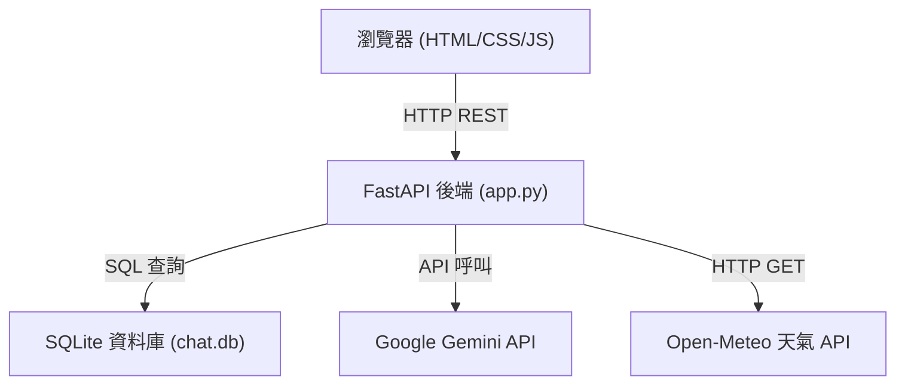
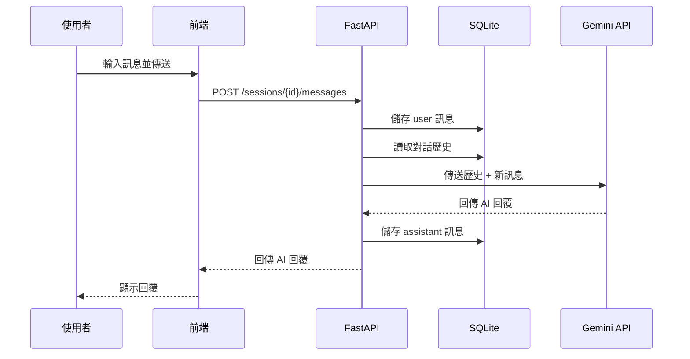

# 系統架構文件

## 1. 架構概覽

本系統採用「前後端整合」架構，FastAPI 同時作為 API 伺服器與靜態檔案伺服器，使用 SQLite 作為輕量資料庫，透過 Google Gemini API 提供 AI 對話能力。



---

## 2. 技術選型

| 層次 | 技術 | 版本 | 選擇原因 |
|------|------|------|---------|
| 前端 | HTML + CSS + JS | - | 輕量、無需編譯、易於部署 |
| 後端框架 | FastAPI | 0.110+ | 高效能、自動產生 API 文件、原生 async 支援 |
| ASGI 伺服器 | Uvicorn | 0.29+ | 高效能非同步伺服器 |
| 資料庫 | SQLite | 3.x | 零設定、檔案型資料庫、適合單機部署 |
| AI 模型 | Google Gemini 1.5 Flash | - | 快速回應、支援多模態（文字+圖片） |
| 天氣 API | Open-Meteo | - | 免費、無需 API Key |

---

## 3. 系統元件說明

### 3.1 前端（templates/index.html）

- **左側欄**：聊天室列表、新增/刪除按鈕
- **主區域**：訊息顯示區（Markdown 渲染支援）
- **底部工具列**：文字輸入框、傳送按鈕、檔案上傳按鈕
- 透過 `fetch` API 與後端溝通

### 3.2 後端（app.py）

- **路由層**：處理 HTTP 請求，回傳對應資料
- **業務邏輯層**：Session 管理、訊息處理、Gemini 呼叫
- **資料存取層**：SQLite CRUD 操作
- **工具整合層**：天氣 API 呼叫

### 3.3 資料庫（chat.db）

- 三張資料表：`sessions`、`messages`、`user_preferences`
- 使用 Python 標準函式庫 `sqlite3`

---

## 4. 資料流程圖



---

## 5. API 端點設計

| 方法 | 路徑 | 說明 |
|------|------|------|
| `GET` | `/` | 回傳前端 HTML 頁面 |
| `POST` | `/sessions` | 建立新聊天室 |
| `GET` | `/sessions` | 列出所有聊天室 |
| `DELETE` | `/sessions/{session_id}` | 刪除指定聊天室及其訊息 |
| `POST` | `/sessions/{session_id}/messages` | 發送訊息並獲取 AI 回覆 |
| `GET` | `/sessions/{session_id}/messages` | 取得聊天室的所有訊息 |
| `POST` | `/sessions/{session_id}/regenerate` | 重新生成最後一則 AI 回覆 |
| `POST` | `/upload` | 上傳圖片或文件 |
| `GET` | `/weather` | 查詢天氣（需提供城市名稱） |
| `GET` | `/preferences` | 取得使用者偏好設定 |
| `PUT` | `/preferences` | 更新使用者偏好設定 |

---

## 6. 資料庫 Schema

```sql
-- 聊天室資料表
CREATE TABLE sessions (
    id TEXT PRIMARY KEY,
    title TEXT NOT NULL,
    created_at TEXT NOT NULL,
    updated_at TEXT NOT NULL
);

-- 訊息資料表
CREATE TABLE messages (
    id TEXT PRIMARY KEY,
    session_id TEXT NOT NULL,
    role TEXT NOT NULL,        -- 'user' 或 'assistant'
    content TEXT NOT NULL,
    timestamp TEXT NOT NULL,
    has_attachment INTEGER DEFAULT 0,
    FOREIGN KEY (session_id) REFERENCES sessions(id) ON DELETE CASCADE
);

-- 使用者偏好資料表
CREATE TABLE user_preferences (
    id INTEGER PRIMARY KEY AUTOINCREMENT,
    key TEXT UNIQUE NOT NULL,
    value TEXT NOT NULL,
    updated_at TEXT NOT NULL
);
```

---

## 7. 部署架構

```
本機開發環境
├── Python 3.10+
├── .venv/（虛擬環境）
├── .env（環境變數，含 GEMINI_API_KEY）
├── chat.db（自動建立）
└── uvicorn app:app --reload（開發伺服器）

訪問：http://localhost:8000
```
