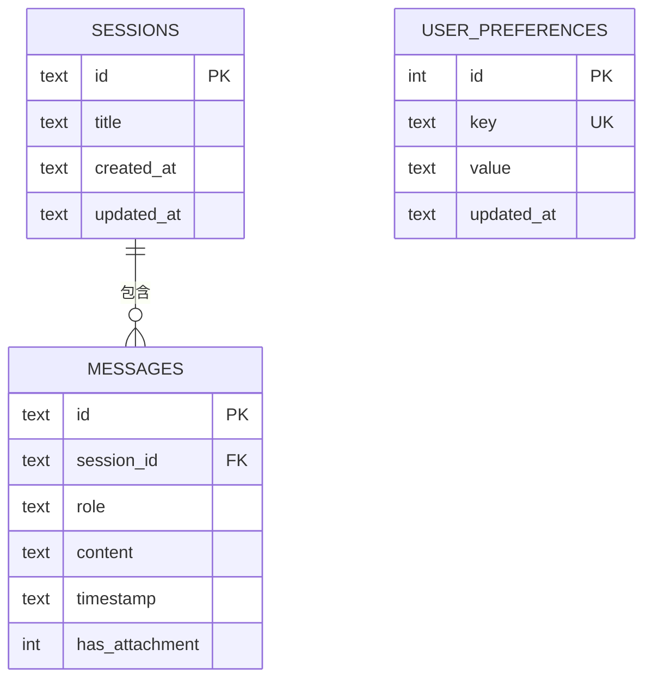

# 資料模型文件

## 1. 資料庫模型

### Sessions（聊天室）

| 欄位 | 類型 | 限制 | 說明 |
|------|------|------|------|
| `id` | TEXT | PRIMARY KEY, NOT NULL | UUID v4 格式的唯一識別碼 |
| `title` | TEXT | NOT NULL | 聊天室標題（預設為「新對話」） |
| `created_at` | TEXT | NOT NULL | 建立時間（ISO 8601 格式） |
| `updated_at` | TEXT | NOT NULL | 最後更新時間（ISO 8601 格式） |

---

### Messages（訊息）

| 欄位 | 類型 | 限制 | 說明 |
|------|------|------|------|
| `id` | TEXT | PRIMARY KEY, NOT NULL | UUID v4 格式的唯一識別碼 |
| `session_id` | TEXT | NOT NULL, FK | 關聯的聊天室 ID |
| `role` | TEXT | NOT NULL | 發送者角色：`user` 或 `assistant` |
| `content` | TEXT | NOT NULL | 訊息內容（純文字或 Markdown） |
| `timestamp` | TEXT | NOT NULL | 訊息時間戳（ISO 8601 格式） |
| `has_attachment` | INTEGER | DEFAULT 0 | 是否含附件（0=否, 1=是） |

**關聯**：`messages.session_id` → `sessions.id`（ON DELETE CASCADE）

---

### UserPreferences（使用者偏好）

| 欄位 | 類型 | 限制 | 說明 |
|------|------|------|------|
| `id` | INTEGER | PRIMARY KEY AUTOINCREMENT | 自動遞增 ID |
| `key` | TEXT | UNIQUE, NOT NULL | 偏好設定的鍵名 |
| `value` | TEXT | NOT NULL | 偏好設定的值（JSON 字串） |
| `updated_at` | TEXT | NOT NULL | 最後更新時間（ISO 8601 格式） |

**預設偏好設定**：

| key | 預設 value | 說明 |
|-----|-----------|------|
| `language` | `"zh-TW"` | 回應語言 |
| `response_style` | `"friendly"` | 回應風格（friendly/formal/concise） |
| `username` | `"使用者"` | 顯示名稱 |

---

## 2. Pydantic 模型（API Schema）

### Request Models

```python
class CreateSessionRequest(BaseModel):
    title: str = "新對話"

    # 範例：{"title": "Python 學習筆記"}

class SendMessageRequest(BaseModel):
    content: str                      # 訊息文字內容
    attachment_path: Optional[str] = None  # 上傳檔案的路徑

    # 範例：{"content": "請分析這張圖片", "attachment_path": "/tmp/image.png"}

class UpdatePreferencesRequest(BaseModel):
    language: Optional[str] = None
    response_style: Optional[str] = None
    username: Optional[str] = None

    # 範例：{"language": "zh-TW", "response_style": "concise"}
```

### Response Models

```python
class SessionResponse(BaseModel):
    id: str
    title: str
    created_at: str
    updated_at: str

    # 範例：
    # {
    #   "id": "550e8400-e29b-41d4-a716-446655440000",
    #   "title": "新對話",
    #   "created_at": "2024-01-01T10:00:00",
    #   "updated_at": "2024-01-01T10:05:00"
    # }

class MessageResponse(BaseModel):
    id: str
    session_id: str
    role: str                  # "user" 或 "assistant"
    content: str
    timestamp: str
    has_attachment: bool

    # 範例：
    # {
    #   "id": "msg-001",
    #   "session_id": "550e8400-...",
    #   "role": "assistant",
    #   "content": "你好！有什麼我可以幫助你的嗎？",
    #   "timestamp": "2024-01-01T10:01:00",
    #   "has_attachment": false
    # }

class ChatResponse(BaseModel):
    user_message: MessageResponse
    ai_message: MessageResponse

class PreferencesResponse(BaseModel):
    language: str
    response_style: str
    username: str
```

---

## 3. 模型關聯圖



---

## 4. 資料範例

### Session 資料範例

```json
{
  "id": "550e8400-e29b-41d4-a716-446655440000",
  "title": "Python 學習筆記",
  "created_at": "2024-01-01T10:00:00",
  "updated_at": "2024-01-01T10:30:00"
}
```

### Message 資料範例

```json
[
  {
    "id": "msg-001",
    "session_id": "550e8400-e29b-41d4-a716-446655440000",
    "role": "user",
    "content": "什麼是 Python 的 GIL？",
    "timestamp": "2024-01-01T10:00:05",
    "has_attachment": false
  },
  {
    "id": "msg-002",
    "session_id": "550e8400-e29b-41d4-a716-446655440000",
    "role": "assistant",
    "content": "GIL（Global Interpreter Lock）是 Python 的全域直譯器鎖...",
    "timestamp": "2024-01-01T10:00:08",
    "has_attachment": false
  }
]
```
