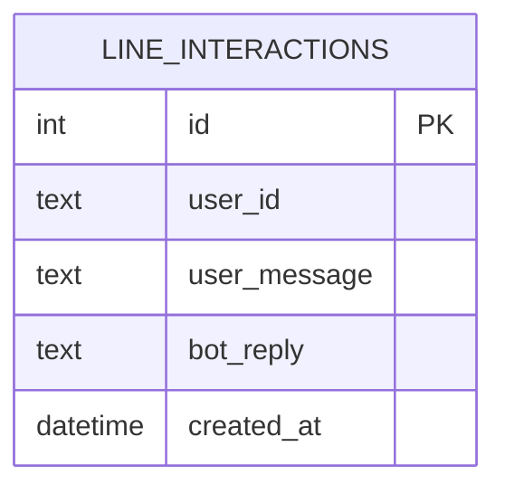

# 資料模型文件

**專案名稱**：股票 LINE Bot — AI 股票分析助理
**版本**：v2.0.0
**最後更新**：2026-05-05

---

## 1. 資料庫模型

### line_interactions（LINE 互動紀錄）

這是這週新增的核心資料表，用來記錄每一次 LINE 使用者與 Bot 的互動。

| 欄位 | 類型 | 限制 | 說明 |
|---|---|---|---|
| `id` | INTEGER | PRIMARY KEY AUTOINCREMENT | 自動遞增，不需手動填 |
| `user_id` | TEXT | NOT NULL | LINE 使用者 UID（LINE 平台提供，格式通常為 `U` 開頭的 33 位字串） |
| `user_message` | TEXT | NOT NULL | 使用者傳送的原始訊息內容 |
| `bot_reply` | TEXT | NOT NULL | Bot 回覆的文字內容（由 Gemini 生成） |
| `created_at` | DATETIME | DEFAULT CURRENT_TIMESTAMP | 互動發生的時間，自動填入 |

**建立資料表的 SQL**：

```sql
CREATE TABLE IF NOT EXISTS line_interactions (
    id           INTEGER  PRIMARY KEY AUTOINCREMENT,
    user_id      TEXT     NOT NULL,
    user_message TEXT     NOT NULL,
    bot_reply    TEXT     NOT NULL,
    created_at   DATETIME DEFAULT CURRENT_TIMESTAMP
);
```

---

## 2. LINE Webhook Event 模型（v3 SDK）

這是 LINE Platform 傳給我們的 Webhook 資料結構，用 `line-bot-sdk-python v3` 解析。

### MessageEvent（我們處理的主要 Event 類型）

```python
# 從 linebot.v3.webhooks.models import 進來的物件
MessageEvent(
    type="message",                          # Event 類型
    timestamp=1234567890123,                 # Unix 毫秒時間戳
    source=UserSource(
        type="user",
        user_id="Uxxxxxxxxxxxxxxxxxxxxxxxxxxxxxxxxx"  # LINE UID
    ),
    reply_token="nHuyWiB7yP5Zw52FIkcQobQuGDXCTA",    # 回覆用（只能用一次）
    message=TextMessageContent(
        id="444573844083572737",
        type="text",
        text="台積電最近走勢怎麼樣？"              # 使用者傳的文字
    )
)
```

### 我們需要從 Event 取出的欄位

| Event 欄位 | 對應變數 | 用途 |
|---|---|---|
| `event.source.user_id` | `user_id` | 寫入 SQLite |
| `event.message.text` | `user_message` | 傳給 Gemini + 寫入 SQLite |
| `event.reply_token` | `reply_token` | 呼叫 LINE Reply API（只能用一次） |

---

## 3. Gemini API 呼叫模型

### 輸入（Prompt）

```python
prompt = f"""你是一個股票資訊分析助理，專門回答股票、投資、產業分析相關問題。
請用繁體中文回覆，語氣友善、清楚。

⚠️ 免責聲明：以下分析僅供參考，不構成投資建議，請使用者自行判斷。

使用者問題：{user_message}

如果問題與股票無關，請禮貌說明你主要負責股票相關問題，並引導使用者提問。"""
```

### 輸出（回覆）

```python
response = model.generate_content(prompt)
bot_reply: str = response.text   # 純文字回覆
```

---

## 4. LINE Reply API 呼叫模型（v3 SDK）

### ReplyMessageRequest

```python
from linebot.v3.messaging.models import ReplyMessageRequest, TextMessage

request = ReplyMessageRequest(
    reply_token=reply_token,        # 從 Event 取得的 replyToken
    messages=[
        TextMessage(text=bot_reply) # Gemini 產生的回覆
    ]
)

# 呼叫方式
with ApiClient(configuration) as api_client:
    line_bot_api = MessagingApi(api_client)
    line_bot_api.reply_message(request)
```

> ⚠️ `reply_token` 只能使用一次，且有效期限約 30 秒。

---

## 5. 模型關聯圖



> 這週的架構相對簡單，只有一張資料表。LINE 的 user_id 本身就是唯一識別碼，不需要額外的 Users 資料表。

---

## 6. 資料範例

### SQLite 紀錄範例

```json
{
  "id": 1,
  "user_id": "U4af4980629...",
  "user_message": "台積電最近走勢怎麼樣？",
  "bot_reply": "台積電（2330）近期受到 AI 晶片需求強勁帶動，整體走勢維持多頭格局。⚠️ 以上分析僅供參考，不構成投資建議。",
  "created_at": "2026-05-05 12:30:45"
}
```

### LINE Webhook Body 範例（LINE Platform 發過來的）

```json
{
  "destination": "Uxxxxxxxxxx",
  "events": [
    {
      "type": "message",
      "timestamp": 1715908245000,
      "replyToken": "nHuyWiB7yP5Zw52FIkcQobQuGDXCTA",
      "source": {
        "type": "user",
        "userId": "U4af4980629..."
      },
      "message": {
        "type": "text",
        "id": "444573844083572737",
        "text": "台積電最近走勢怎麼樣？"
      }
    }
  ]
}
```

---

## 7. 環境變數對應

| 變數名稱 | 用途 | 在哪裡用 |
|---|---|---|
| `LINE_CHANNEL_ACCESS_TOKEN` | 呼叫 LINE Reply API 的授權 Token | `Configuration(access_token=...)` |
| `LINE_CHANNEL_SECRET` | 驗證 Webhook 請求的 `X-Line-Signature` | `WebhookParser(channel_secret=...)` |
| `GEMINI_API_KEY` | 呼叫 Google Gemini API | `genai.configure(api_key=...)` |
